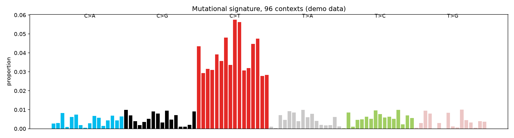

# Mutation Signature Barplot

Every mutagen — UV light, tobacco smoke, a broken repair gene — leaves a distinctive pattern of mutations. Read that pattern and you can often name the cause of a cancer.

## Why This Matters

Cancer genomes carry thousands of mutations, but they are not random: each mutagenic process favours particular base changes in particular sequence contexts. Summarising mutations into the 96 trinucleotide contexts exposes that fingerprint, which you then match against known COSMIC signatures to infer aetiology.

## How It Works

1. Classify each mutation by its base change and flanking bases (96 categories).
2. Count the proportion in each context.
3. Bar-plot all 96 — the shape is the signature.

## What the Demo Shows



The demo builds a signature dominated by C>T changes (the hallmark of UV damage and ageing). The tall block of red C>T bars is the visual fingerprint you would compare against reference signatures to name the process.

## Run It

```bash
pip install -r requirements.txt
python demo.py
```

> Demonstrated on synthetic data, so it's fully reproducible with no external downloads.
